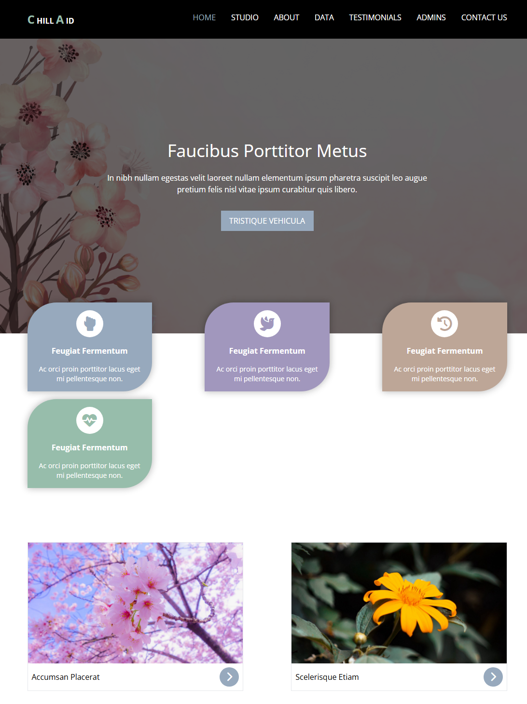
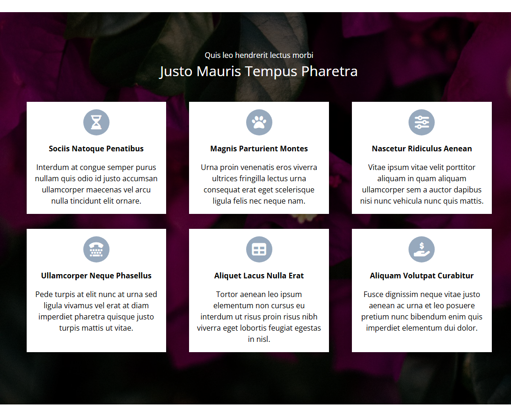
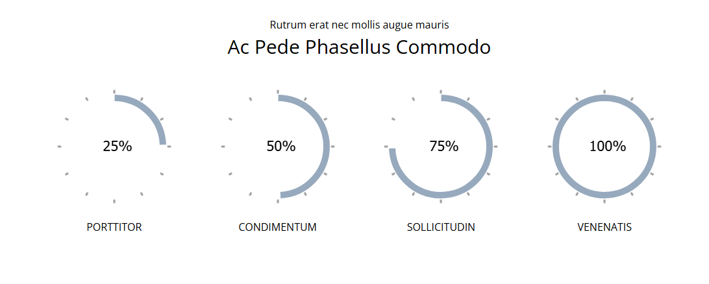
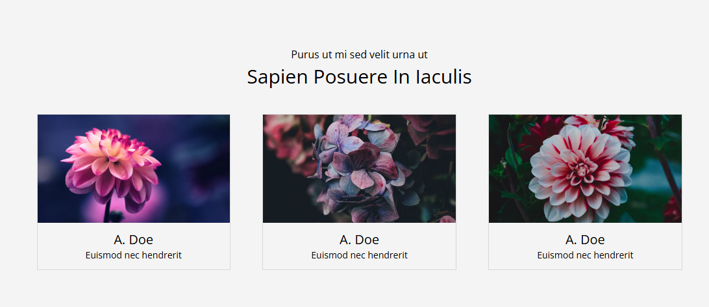
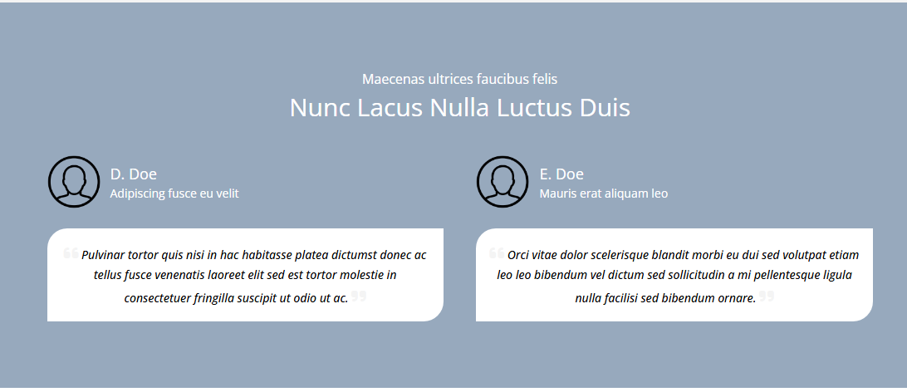
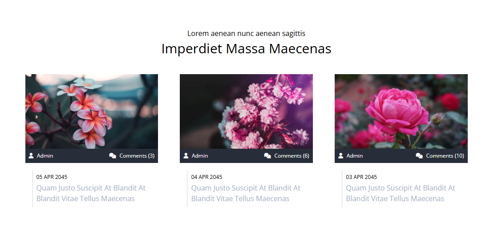
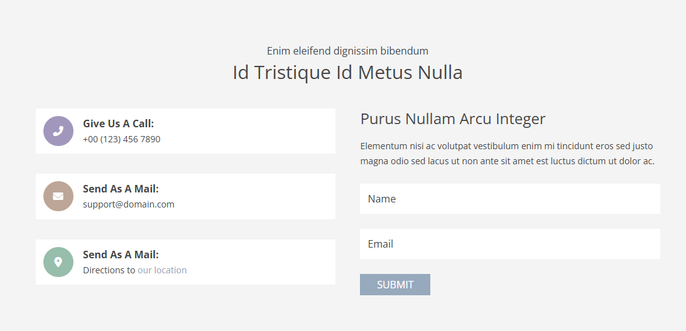
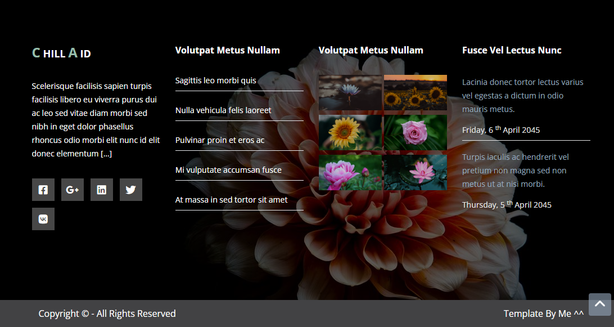

# ChillAid Template

## What technology is used here?

I used Html, Css "Tailwind", Javascript

## Template Review

### Landing

### Services Section

### Degress Section

### Team Section

### Testimonials

### Projects Section

### Contact us

### Footer

## Links

- Facebook
  https://www.facebook.com/profile.php?id=100085749470017

- X
  https://twitter.com/ahmed_magdy135
